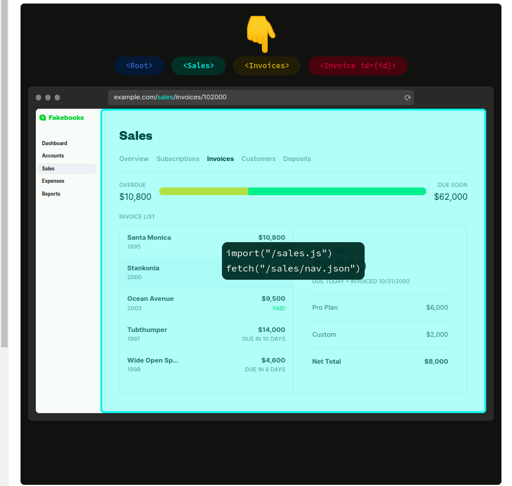

# Remix


## Pontos

- Framework Fullstack
- Server Side Render
- Focado no gerenciamento de rotas
- Prefetch de rota
- Nested routers
- Pensado para trabalhar com Edge Network
- Traz de volta os Web Fundamentals
- Gerenciamento de error via ErrorBoundary
- Bubble up do erro
- Nova forma de se trabalhar - **COLOCATION**
- Prefetch intent

## Estrutura do código Remix

```ts
// Executado quando a rota é acessada
export async function loader(): LoaderFunction {}

// Executado quando um form submete dados para a rota
export async function action(): ActionFunction {}

// Adiciona no <header> os <links> retornados pela função
export async function links(): LinksFunction {}

// Qualquer <meta> que se queira adicionar ao <header>
export function meta(): MetaFunction {}

// Defini o que será apresentado ao usuário caso um erro aconteça no loader
export function ErrorBoundary() {}

// Aqui vai o component React
export default function () {}
```

## Nested Routers

### exemplo


